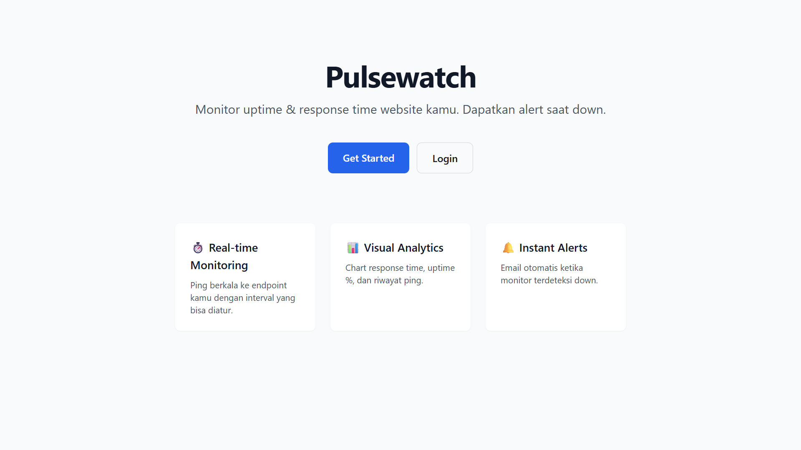
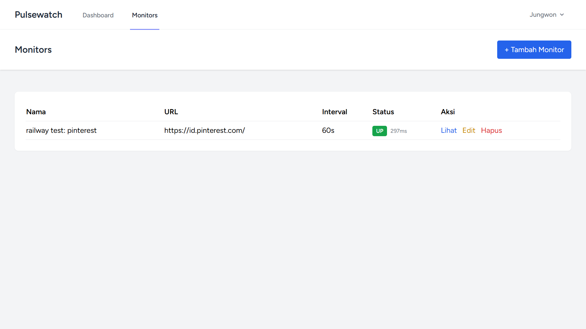
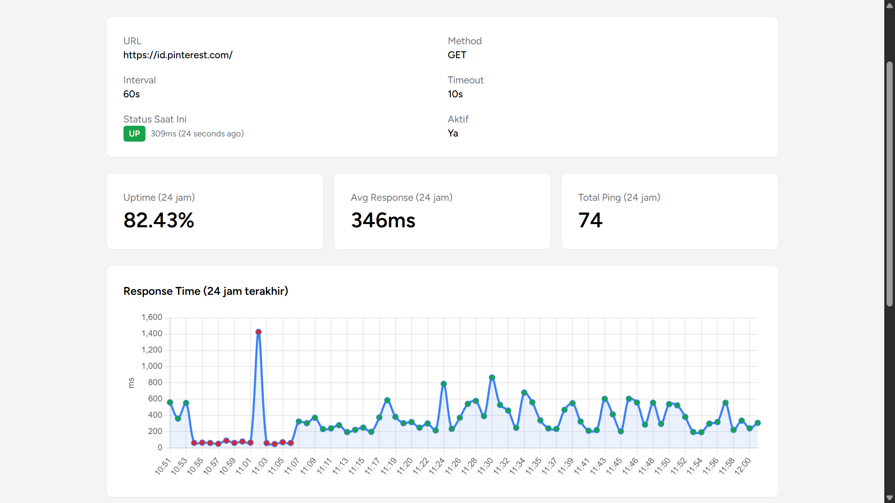
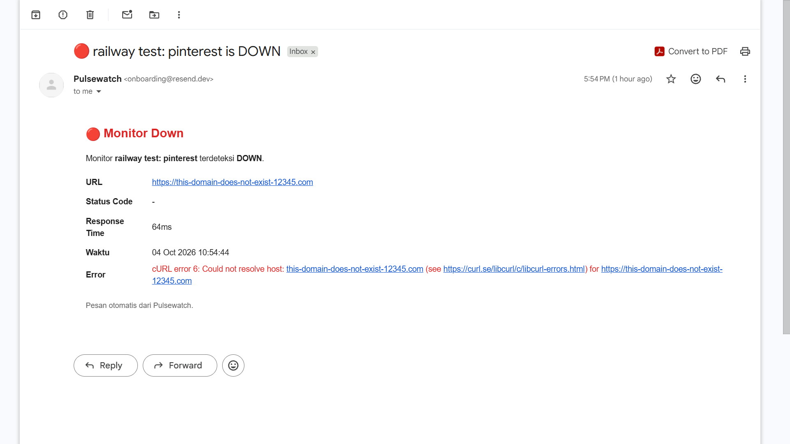
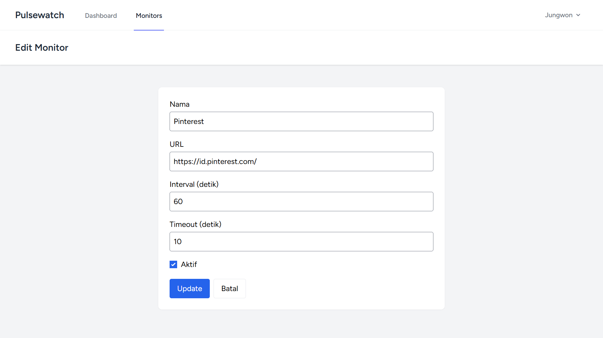

# 📡 Pulsewatch

**Uptime & performance monitoring for your websites and APIs.**

Pulsewatch is a cloud-deployed monitoring tool that pings your endpoints on schedule, stores response metrics over time, and sends email alerts the moment something goes down.

[🔗 Live Demo](https://pulsewatch-production.up.railway.app) · [📂 GitHub](https://github.com/arachnoids/pulsewatch)

---

## ✨ Features

- ⏱️ **Scheduled pings** — configurable interval per monitor (30s–1h)
- 📊 **Visual dashboard** — response time chart, uptime %, avg response
- 🔔 **Email alerts** — automatic notifications on status transitions (up → down, down → up)
- 👤 **Multi-user** — each user has their own private monitors
- 🔒 **Isolated data** — user-scoped queries with authorization checks
- ✏️ **Full CRUD** — create, edit, delete, and toggle monitors
- ☁️ **Cloud-native** — web, worker, and scheduler deployed as separate services

---

## 📸 Screenshots

### Landing Page


### Dashboard — Monitor List


### Monitor Detail — Chart & Statistics


### Email Alert on Downtime


### Edit Monitor


---

## 🏗️ Architecture

```
┌─────────────────┐
│   Web (Laravel) │──────┐
└─────────────────┘      │
                         ▼
┌─────────────────┐    ┌──────────────┐
│  Cron Service   │───▶│  PostgreSQL  │
│  (schedule:run) │    │  (Railway)   │
└─────────────────┘    └──────────────┘
         │                     ▲
         │ dispatch jobs       │
         ▼                     │
┌─────────────────┐            │
│  Queue (DB)     │            │
└─────────────────┘            │
         │                     │
         ▼                     │
┌─────────────────┐            │
│ Worker Service  │────────────┘
│ (queue:work)    │
└─────────────────┘
         │
         │ HTTP requests
         ▼
┌─────────────────┐
│ Target Websites │
└─────────────────┘
```

### How It Works

1. **Cron service** runs `schedule:run` every minute → dispatches `PingMonitor` jobs for active monitors
2. **Queue** (database driver) holds the pending jobs
3. **Worker service** pulls jobs from the queue and executes them
4. Each `PingMonitor` job sends an HTTP request to the target URL, records the result, and detects status transitions
5. On `up → down` transition, an **email alert** is sent via Resend
6. **Web service** provides the dashboard, CRUD for monitors, and visualizations

---

## 🛠️ Tech Stack

| Layer | Technology |
|---|---|
| Backend | Laravel 12 |
| Database | PostgreSQL |
| Queue | Database queue driver |
| Frontend | Blade + Tailwind + Alpine.js |
| Chart | Chart.js |
| Email | Resend |
| Deployment | Railway (web + worker + cron + Postgres) |
| Auth | Laravel Breeze |

---

## 🚀 Local Development

### Prerequisites

- PHP 8.2+
- Composer
- Node.js 18+
- MySQL (or XAMPP)

### Setup

```bash
# Clone
git clone https://github.com/arachnoids/pulsewatch.git
cd pulsewatch

# Install dependencies
composer install
npm install

# Environment
cp .env.example .env
php artisan key:generate

# Configure DB in .env, then:
php artisan migrate

# Run (3 terminals)
php artisan serve            # Terminal 1: web
npm run dev                  # Terminal 2: frontend
php artisan queue:work       # Terminal 3: worker

# Optional: dispatch pings manually (instead of waiting for scheduler)
php artisan monitors:dispatch
```

---

## 🎯 Design Decisions

### Why a separate worker service?
Pings are I/O-bound and can take seconds. Executing them inside the request cycle would block the web app. By moving them to a queue + worker, the web stays responsive and pings scale independently.

### Why database queue instead of Redis?
For a portfolio-scale app, the database queue eliminates an extra service dependency. The trade-off is throughput — fine at this scale, but Redis would be the next step for higher volume.

### Why state-transition-based alerts?
Alerting on *every* failed ping would spam users during outages. By only alerting on status *transitions* (up → down, down → up), users get exactly one alert per incident.

### Why store time-series data indexed on `(monitor_id, checked_at)`?
Uptime calculations and charts query by monitor over time ranges. A composite index makes these queries O(log n) instead of full table scans.

---

## 📚 Documentation

- [Architecture Details](ARCHITECTURE.md)

---

## 📝 License

MIT